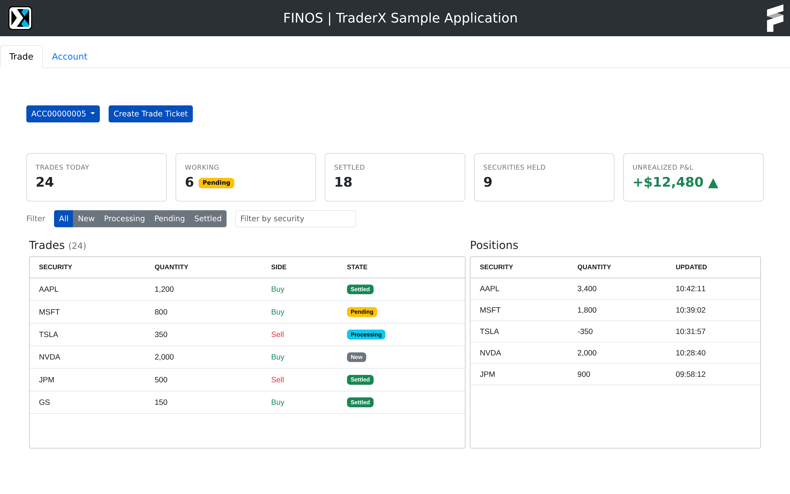

# Design: Trade page — blotter summary strip

Target state for `/trade` (`main/app/trade/trade.component.html`). Everything below the existing
account dropdown + **Create Trade Ticket** row is new; the navbar, tabs, ops row and the two
blotters stay exactly as they are.

Written in the vocabulary of [`../frontend/design-system.md`](../frontend/design-system.md) and
[`../frontend/component-patterns.md`](../frontend/component-patterns.md) — read those first.

## 1. Summary strip

A `row g-3 mb-3` of Bootstrap `card`s (`card-body py-3`), one per `col`, directly under the ops
row. Each card: an uppercase caption (`text-secondary text-uppercase`, small) over a
`fs-4 fw-semibold` figure.

| Card | Value | Source |
| --- | --- | --- |
| Trades today | count of trades for the selected account | `PositionService.getTrades(accountId)` |
| Working | count of trades whose `state` is `New`, `Processing` or `Pending`, with a `badge text-bg-warning` reading `Pending` beside it | same array |
| Settled | count of `state === State.Settled` | same array |
| Securities held | number of distinct `security` values with non-zero `quantity` | `PositionService.getPositions(accountId)` |
| ~~Unrealized P&L~~ | ~~`+$12,480 ▲`~~ | **nothing — see below** |

**The P&L card cannot be built.** No endpoint in TraderX returns a price, a notional or a
valuation: `Trade` and `Position` carry `security`, `quantity`, `side`, `state` and timestamps, and
reference data is ticker + company name only. Ship the four supportable cards, leave the fifth out,
and call it out in the PR. Do not derive, mock, or hard-code a P&L number.

Counts must stay live: they are computed from the same data the trade blotter holds, so they
update when a feed message arrives, not only on account change.

## 2. State filter

A `d-flex align-items-center mb-3` row between the cards and the blotters:

- Label `Filter` (`text-secondary me-3`).
- A `btn-group me-3` of five buttons — `All`, `New`, `Processing`, `Pending`, `Settled`. Selected
  is `btn btn-sm btn-primary`, unselected `btn btn-sm btn-secondary` (the same selected/unselected
  idiom as the Buy/Sell toggle in the trade ticket). Default `All`.
- A `form-control form-control-sm` (~220px) `placeholder="Filter by security"`, matching on
  substring, case-insensitive.

Both filters apply to the **Trades** blotter only; Positions is untouched. Filtering is client-side
over rows already loaded — no new request, no new endpoint. Use AG Grid's own filtering
(`setFilterModel` / `onFilterChanged`) or an external filter rather than rebuilding `rowData`, so
that live `applyTransaction` updates keep working.

The counts in the cards describe the **account**, not the current filter — they don't change when
a filter is applied.

## 3. Blotter heading

`<h5>Trades (24)</h5>` — the count in parentheses is the
number of rows currently visible after filtering.

## Structure

Keep `TradeComponent` the container. The strip and the filter are presentational children in
`main/app/trade/`, declared in `TradeModule`:

- `app-blotter-summary` — `@Input() trades: Trade[]`, `@Input() positions: Position[]`. No service
  injection, no `HttpClient`.
- `app-blotter-filter` — `@Output() stateChange: EventEmitter<State | 'All'>`,
  `@Output() securityChange: EventEmitter<string>`.

The container owns the selected state/security and passes them into `app-trade-blotter` as inputs.

## Selectors

`id` on every new control, per [`../frontend/testing-and-selectors.md`](../frontend/testing-and-selectors.md):
`tradesTodayCard`, `workingCard`, `settledCard`, `securitiesHeldCard`, `stateFilterAll`,
`stateFilterNew`, `stateFilterProcessing`, `stateFilterPending`, `stateFilterSettled`,
`securityFilterInput`.

## Out of scope

Sorting, pagination, column pickers, date ranges, exports, and anything requiring a backend change.
