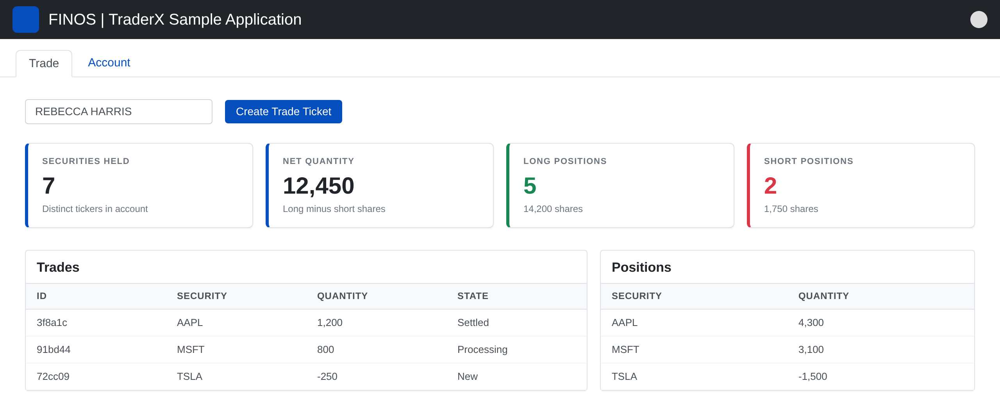

# Mocks

Design mocks for the TraderX front end. Each mock is the spec for a change: match placement,
labels, ordering and colour semantics, and fill any gaps from
[`../design-system.md`](../design-system.md).

## `trade-page-positions-summary.png`

**Screen:** Trade tab (`web-front-end/angular`, `main/app/trade/trade.component.html`).

**What is new:** a four-card metric strip between the ops row (account selector + *Create Trade
Ticket*) and the Trades / Positions blotters. Everything else on the page is unchanged.

**Cards, left to right:**

| Label | Value | Caption | Accent |
| --- | --- | --- | --- |
| SECURITIES HELD | count of distinct securities with a non-zero position | "Distinct tickers in account" | brand blue |
| NET QUANTITY | sum of all position quantities | "Long minus short shares" | brand blue |
| LONG POSITIONS | count of positions with quantity > 0 | "<n> shares" (total long shares) | green |
| SHORT POSITIONS | count of positions with quantity < 0 | "<n> shares" (total short shares, absolute) | red |

**Behaviour (not visible in the image, but expected):**

- Scoped to the account selected in the dropdown; recalculates when the account changes.
- Updates live from the same `/accounts/{id}/positions` trade-feed topic the positions blotter uses.
- Empty/unselected account renders the cards with zeros rather than disappearing.
